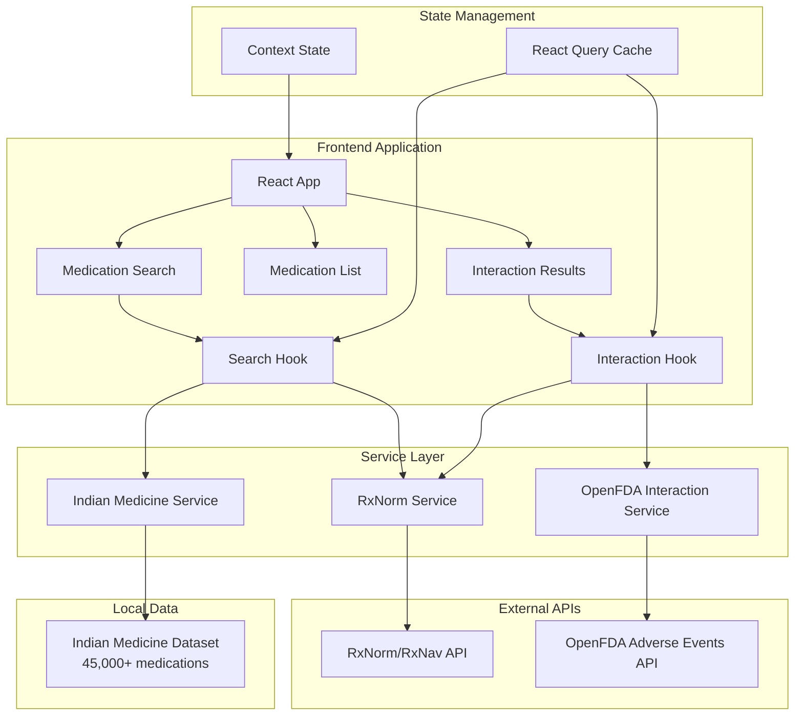
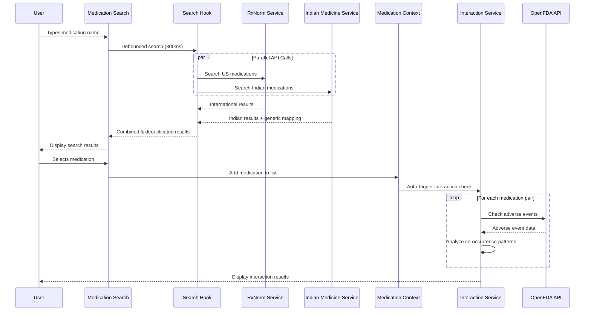
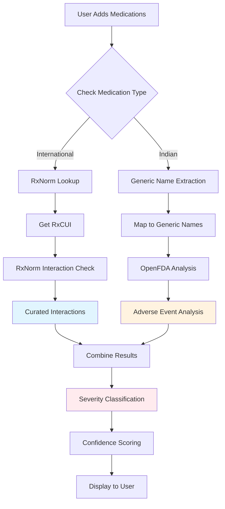
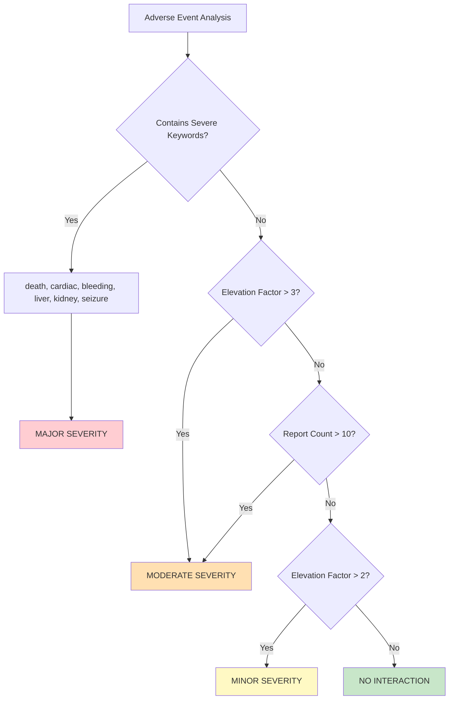

# MedCheck - Drug Interaction Checker


A comprehensive drug interaction checker that supports both international (US) and Indian medications, providing real-time safety analysis through multiple API integrations and advanced adverse event analysis.

## 🎯 Table of Contents

- [Overview](#overview)
- [Key Features](#key-features)
- [Technology Stack](#technology-stack)
- [System Architecture](#system-architecture)
- [API Documentation](#api-documentation)
- [Interaction Detection Methodology](#interaction-detection-methodology)
- [Installation & Setup](#installation--setup)
- [Usage Guide](#usage-guide)
- [Data Sources](#data-sources)
- [Contributing](#contributing)
- [License](#license)
- [Disclaimer](#disclaimer)

## 🔬 Overview

MedCheck is a modern React-based application that helps users identify potential drug interactions by combining multiple authoritative data sources. The application supports both international medications through the RxNorm database and Indian medications through a comprehensive local dataset, providing a unique dual-coverage approach to medication safety.

### Problem Statement

Drug interactions are a significant cause of adverse events and hospitalizations. Traditional interaction checkers often:
- Focus primarily on US/European medications
- Miss regional medication variants
- Rely on limited data sources
- Lack real-world adverse event analysis

### Our Solution

MedCheck addresses these gaps by:
- **Hybrid Database Approach**: Combining RxNorm (US) with Indian medication data
- **Real-World Evidence**: Using FDA adverse event reports for interaction analysis
- **Smart Generic Mapping**: Extracting active ingredients for cross-database compatibility
- **Modern UX**: Clean, responsive interface with real-time feedback

## ✨ Key Features

### 🔍 **Intelligent Drug Search**
- **Dual-Source Search**: Searches both international (RxNorm) and Indian medication databases simultaneously
- **Fuzzy Matching**: Smart search with typo tolerance and synonym recognition
- **Auto-Complete**: Real-time suggestions with debounced search (300ms)
- **Generic Name Extraction**: Automatically identifies active ingredients from brand names

### ⚠️ **Advanced Interaction Detection**
- **Multiple Detection Methods**: 
  - RxNorm curated interactions
  - OpenFDA adverse event co-occurrence analysis
  - Generic name cross-referencing
- **Severity Classification**: Major, Moderate, Minor, and None categories
- **Confidence Scoring**: Statistical confidence based on report volume and consistency
- **Real-Time Analysis**: Automatic interaction checking as medications are added

### 🇮🇳 **Indian Medication Support**
- **Comprehensive Database**: 45,000+ Indian medications with pricing
- **Manufacturer Information**: Complete pharmaceutical company details
- **Generic Mapping**: Advanced extraction of active ingredients from compositions
- **Price Transparency**: Current Indian market prices in INR

### 📊 **Evidence-Based Reporting**
- **FDA Adverse Events**: Analysis of real-world safety reports
- **Statistical Analysis**: Elevation factors and frequency comparisons
- **Detailed Descriptions**: User-friendly explanations of potential interactions
- **Source Attribution**: Clear methodology and data source identification

## 🛠 Technology Stack

### Frontend
- **React 19.1.1** - Modern UI library with latest features
- **Vite 7.1.2** - Fast build tool and development server
- **Tailwind CSS 4.1.13** - Utility-first CSS framework
- **Lucide React** - Modern icon library

### State Management & Data Fetching
- **TanStack Query (React Query) 5.89.0** - Powerful data synchronization
- **React Context** - Global state management for medications
- **Custom Hooks** - Reusable logic for search and interactions

### APIs & Data Sources
- **RxNorm/RxNav API** - NIH National Library of Medicine
- **OpenFDA API** - FDA Adverse Event Reporting System
- **Indian Medicine Database** - Local comprehensive dataset

### Development Tools
- **ESLint** - Code quality and consistency
- **React Hook Form** - Form handling and validation
- **Axios** - HTTP client for API requests

## 🏗 System Architecture

### High-Level Architecture



### Data Flow Architecture



## 📚 API Documentation

### 1. RxNorm/RxNav API (NIH)

**Base URL**: `https://rxnav.nlm.nih.gov/REST`

#### Drug Search Endpoint
```
GET /drugs.json?name={searchTerm}
```

**Purpose**: Search for medications in the RxNorm database
**Response**: Structured drug information with RxCUI identifiers
**Rate Limits**: None specified, but respectful usage recommended

#### Interaction Endpoint
```
GET /interaction/interaction.json?rxcui={rxcui}
```

**Purpose**: Get known drug interactions for a specific medication
**Response**: Curated interaction data with severity levels
**Data Sources**: Multiple pharmaceutical databases

### 2. OpenFDA Adverse Events API

**Base URL**: `https://api.fda.gov/drug/event.json`

#### Adverse Events Search
```
GET /drug/event.json?search={query}&count={field}&limit={n}
```

**Purpose**: Analyze real-world adverse events for interaction detection
**Key Features**:
- Co-occurrence analysis of drug pairs
- Reaction frequency comparison
- Statistical significance testing
**Rate Limits**: 240 requests per minute, 120,000 per day

#### Sample Query for Drug Pair Analysis
```javascript
const query = `patient.drug.medicinalproduct:"${drug1}" AND patient.drug.medicinalproduct:"${drug2}"`;
const url = `${OPENFDA_BASE_URL}?search=${encodeURIComponent(query)}&count=patient.reaction.reactionmeddrapt.exact&limit=20`;
```

### 3. Indian Medicine Database (Local)

**Source**: Comprehensive local dataset
**Size**: 45,000+ medications
**Update Frequency**: Periodic updates from Indian pharmaceutical sources

#### Data Structure
```json
{
  "id": "1",
  "name": "Augmentin 625 Duo Tablet",
  "price(₹)": "223.42",
  "Is_discontinued": "FALSE",
  "manufacturer_name": "Glaxo SmithKline Pharmaceuticals Ltd",
  "type": "allopathy",
  "pack_size_label": "strip of 10 tablets",
  "short_composition1": "Amoxycillin (500mg)",
  "short_composition2": "Clavulanic Acid (125mg)"
}
```

## 🧠 Interaction Detection Methodology

### 1. Multi-Source Approach

MedCheck uses a sophisticated multi-layered approach to detect drug interactions:



### 2. Generic Name Extraction Algorithm

For Indian medications, we extract generic names using pattern matching:

```javascript
// Pattern matching for composition extraction
const patterns = [
  /^([A-Za-z\s]+)\s*\(/,          // "Fluoxetine (20mg)" → "Fluoxetine"
  /^([A-Za-z\s]+)\s+\d+/,        // "Amoxycillin 500mg" → "Amoxycillin"
  /^([A-Za-z\s]+)$/               // Clean composition names
];

// Clean up common pharmaceutical suffixes
genericName = genericName
  .replace(/\b(Sodium|Hydrochloride|HCl|Sulphate|Sulfate)\b/gi, '')
  .replace(/\s+/g, ' ')
  .trim();
```

### 3. OpenFDA Adverse Event Analysis

Our proprietary algorithm analyzes FDA adverse event reports to identify potential interactions:

#### Statistical Methodology

1. **Baseline Frequency Calculation**
   ```
   Individual Drug Reaction Rate = Reports with Drug A & Reaction X / Total Reports with Drug A
   ```

2. **Co-occurrence Analysis**
   ```
   Combined Reaction Rate = Reports with Drug A + Drug B + Reaction X / Total Reports with Both Drugs
   ```

3. **Elevation Factor Calculation**
   ```
   Elevation Factor = Combined Rate / max(Individual Rate A, Individual Rate B)
   ```

4. **Significance Thresholds**
   - **Major**: Elevation Factor > 3.0 OR severe reaction keywords
   - **Moderate**: Elevation Factor > 2.0 OR >10 reports
   - **Minor**: Elevation Factor > 1.5 OR notable pattern

#### Severity Classification Algorithm



### 4. Confidence Scoring

Confidence levels are assigned based on data quality and volume:

- **High Confidence**: ≥50 adverse event reports + ≥2 concerning reactions
- **Medium Confidence**: ≥20 reports + ≥1 concerning reaction
- **Low Confidence**: <20 reports or insufficient data

### 5. Caching Strategy

To optimize performance and respect API rate limits:

```javascript
class InteractionCache {
  constructor() {
    this.cache = new Map();
    this.cacheExpiry = 24 * 60 * 60 * 1000; // 24 hours
  }
  
  getCacheKey(drug1, drug2) {
    return [drug1, drug2].sort().join('_'); // Consistent ordering
  }
}
```

## 🚀 Installation & Setup

### Prerequisites

- **Node.js**: Version 18.0.0 or higher
- **npm**: Version 8.0.0 or higher
- **Git**: For cloning the repository

### Step-by-Step Installation

1. **Clone the Repository**
   ```bash
   git clone https://github.com/yourusername/medication.git
   cd medication/med-tracker
   ```

2. **Install Dependencies**
   ```bash
   npm install
   ```

3. **Environment Setup**
   ```bash
   # Create environment file (optional - no API keys required)
   cp .env.example .env
   ```

4. **Start Development Server**
   ```bash
   npm run dev
   ```

5. **Open in Browser**
   ```
   http://localhost:5173
   ```

### Production Build

```bash
# Build for production
npm run build

# Preview production build
npm run preview

# Analyze bundle size
npm run analyze
```

### Docker Setup (Optional)

```dockerfile
FROM node:18-alpine

WORKDIR /app
COPY package*.json ./
RUN npm ci --only=production

COPY . .
RUN npm run build

FROM nginx:alpine
COPY --from=0 /app/dist /usr/share/nginx/html
EXPOSE 80
CMD ["nginx", "-g", "daemon off;"]
```

## 📖 Usage Guide

### 1. Adding Medications

1. **Search**: Type medication name in the search box
2. **Select**: Choose from suggestions (both international and Indian)
3. **Add**: Click to add to your medication list

### 2. Viewing Interactions

- Interactions are checked automatically when you have 2+ medications
- Results show severity levels with color coding:
  - 🔴 **Major**: Potentially dangerous interactions
  - 🟡 **Moderate**: Caution recommended
  - 🟢 **Minor**: Monitor for effects

### 3. Understanding Results

Each interaction shows:
- **Medications involved**
- **Severity level**
- **Confidence score**
- **Number of adverse event reports**
- **Detailed description**
- **Methodology used**

### 4. Removing Medications

- Click the ❌ button next to any medication to remove it
- Interactions are recalculated automatically

## 📊 Data Sources

### RxNorm Database
- **Source**: National Library of Medicine (NIH)
- **Coverage**: US and international medications
- **Updates**: Regular updates from pharmaceutical authorities
- **Reliability**: Gold standard for medication normalization

### OpenFDA Adverse Events
- **Source**: FDA Adverse Event Reporting System (FAERS)
- **Coverage**: Real-world safety reports from healthcare professionals
- **Volume**: Millions of reports spanning decades
- **Updates**: Quarterly releases with new data

### Indian Medication Database
- **Source**: Compiled from Indian pharmaceutical authorities
- **Coverage**: 45,000+ Indian medications
- **Includes**: Pricing, manufacturers, compositions
- **Updates**: Periodic refreshes from official sources

## 🤝 Contributing

We welcome contributions! Please see our [Contributing Guidelines](CONTRIBUTING.md) for details.

### Development Workflow

1. **Fork** the repository
2. **Create** a feature branch (`git checkout -b feature/amazing-feature`)
3. **Commit** your changes (`git commit -m 'Add amazing feature'`)
4. **Push** to the branch (`git push origin feature/amazing-feature`)
5. **Open** a Pull Request

### Code Standards

- **ESLint**: Enforced code quality rules
- **Prettier**: Consistent code formatting
- **Conventional Commits**: Structured commit messages
- **Component Testing**: Test new features and components

## 📄 License

This project is licensed under the MIT License - see the [LICENSE](LICENSE) file for details.

## ⚠️ Disclaimer

**IMPORTANT MEDICAL DISCLAIMER**

MedCheck is a research and educational tool designed to provide general information about potential drug interactions. This application:

- **IS NOT** a substitute for professional medical advice
- **SHOULD NOT** be used for medical diagnosis or treatment decisions
- **DOES NOT** replace consultation with healthcare providers
- **MAY NOT** detect all possible interactions
- **RELIES ON** publicly available data sources that may be incomplete

### Always Consult Healthcare Professionals

- Discuss all medications with your doctor or pharmacist
- Report any adverse effects to your healthcare provider
- Do not start, stop, or change medications without medical supervision
- Seek immediate medical attention for serious symptoms

### Data Accuracy Notice

While we strive for accuracy, medication data and interaction information:
- May contain errors or omissions
- Reflects available data at time of last update
- Should be verified with authoritative medical sources
- May not include the most recent safety information

**By using this application, you acknowledge that you have read and understood this disclaimer.**

---

## 🙏 Acknowledgments

- **National Library of Medicine** for providing the RxNorm API
- **FDA** for making adverse event data publicly available
- **Indian Pharmaceutical Industry** for medication data compilation
- **Open Source Community** for the excellent tools and libraries used

---

**Made with ❤️ for medication safety awareness**

*Last updated: December 2024*
